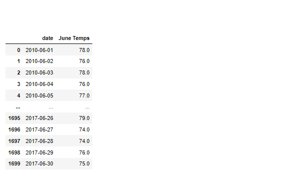
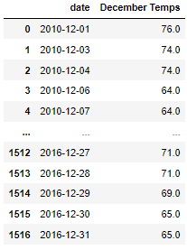

# surfs_up

## Overview of analysis
For this analysis, I was responsible for for building a weather analysis for the island on Hawaii that I would like to open up a Surf and Shake stop for. This analysis would provide the information needed to know if the shop could be substantial year-round.

## Resources
Software used:
* Python
* Visual Studio Code
* Jupyter Notebook
* SQLite
* SQLAlchemy
* JSON
* Flask

Data Source:
hawaii.sqlite

## Results
The first step I took was extracting the data. Using Jupyter Notebook, I imported all of my dependencies and then imported the SQL toolkit.


```
# Dependencies
import numpy as np
import pandas as pd
import datetime as dt

# Python SQL toolkit and Object Relational Mapper
import sqlalchemy
from sqlalchemy.ext.automap import automap_base
from sqlalchemy.orm import Session
from sqlalchemy import create_engine, func
```


I wrote a query that filters the Measurement table to retrieve the temperatures for the month of June and December.

### Query code for June


```
june_temperatures= session.query(Measurement.date, Measurement.tobs).filter(extract('month',Measurement.date)==6).all()
print(june_temperatures)
```

### Query code for December

```
dec_temperatures= session.query(Measurement.date, Measurement.tobs).filter(extract('month',Measurement.date)==12).all()
print(dec_temperatures)
```

After collecting the temperatures for the month of both June and December, I created a DataFrame with a "Date" column and a "June Temps"/"December Temps" column and used the .describe() method to show my results.





